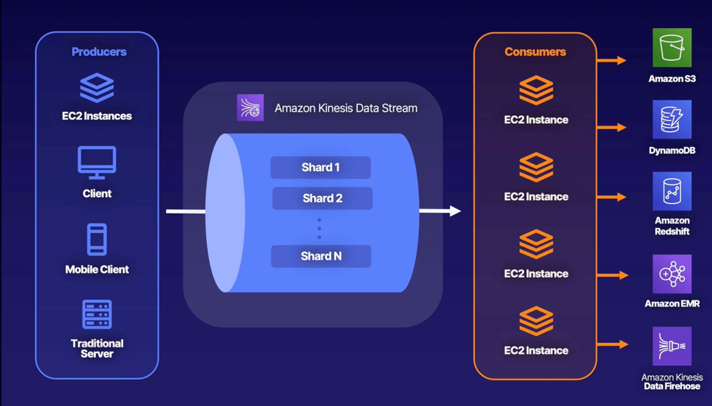

# AWS

I'm preparing for the AWS Associate Architect Certification, these notes will serve me as a quick lookup for all the topics

AWS (Amazon Web Services) is an IaaS (Infrastructure as a Service) company that offers an infrastructure for building applications.

AWS is divided into regions, ex: `us-east-1`, `eu-west-1` and each region will have multiple availability zones (at least 2 to 3). These availability zones are marked as `a, b, c, etc...`

Certification touches on a lot of topics, but they can be categorized into the following sections

* Compute
  * EC2
  * Lambda
  * Elastic Beanstalk
* Storage
  * S3
  * EBS (Elastic Block Storage)
  * EFS (Files)
  * FSx
  * Storage Gateway
* Databases
  * RDS
  * DynamoDB
  * Redshift
* Networking
  * VPC
  * Direct Connect
  * Route 53
  * API Gateway
  * AWS Global Accelerator

### Identity Access Management (IAM)

IAM is global, not regional level.

Permission -> Permission to access a resource (like read, write, etc...)

Policy -> A Policy is a JSON document with a list of permissions. There are 2 types inline policies (Added directly to user/group, not recommended) & managed policies.

Group -> A collection of users to which we can apply policies to

Role -> It's a combination of policies + Trust (Someone has to assume the role to get the permissions)

### Simple Storage Service (S3)

S3 is one of the oldest services offered by AWS. S3 is used for storing objects like images, videos, files, etc... It can also be used for hosting static websites, but it can't be used for dynamic websites that need database connections.

By default, S3 is private. However, we can just policies either at the bucket level or at the object level (ACLs - Access Control List) to make them public.

* Unlimited storage
* Max object size (5 TB)
* Universal Namespace (Global, not per region)
* Versioning (Multiple versions of the object)

There are different tier offerings for S3. S3 is 99.9% available and 99.9 (11 9's) durable. So it's almost impossible to lose an object once uploaded into S3. It's stored across at least 2-3 AZ for redundancy.

<table><thead><tr><th width="288">Tier</th><th>Description</th></tr></thead><tbody><tr><td>S3 Standard</td><td>This is the default Tier.</td></tr><tr><td>S3 Standard - Infrequent Access</td><td>Similar to S3 standard, but for rapid access</td></tr><tr><td>S3 Standard - Infrequent Access One Zone</td><td>The data is saved in only a single zone, and it's cheaper than S3 - IA</td></tr><tr><td>S3 Intelligent Tier</td><td>Intelligently switches the tier to save the maximum on S3 tiering, there is a fee charged for every 1000 objects managed.</td></tr><tr><td>S3 Glacier</td><td><ul><li>Instant Retrieval</li><li>Flexible Retrieval (a couple of minutes to 12 minutes)</li><li>Deep Archive (12hr - 48hr)</li></ul></td></tr></tbody></table>

S3 Object lock and Glacier Vault lock blocks deleting the objects. It's mostly required for Governance Mode (Restricted access to delete objects) & Compliance mode (Not even a root account can delete objects). Versioning is enabled for object locks. WORM (Write Once Read Many)

#### Encryption

* Encryption in transit (HTTPS)
* Encryption at rest (SSE - Server Side Encryption)
  * SSE - S3 (AWS managed keys)
  * SSE - KMS (Key Management Services)
  * SSE - Customer (Customer manages the keys)

SSE - S3 is the default encryption and every bucket in s3 is by default encrypted. In a put request, we could add `x-amz-server-side-encryption` a header to encrypt objects at rest, accepted values are `AES256 & aws:kms` . We can also enforce encryption using bucket policies.

#### Performance

We can increase the performance of the S3 bucket by having multiple prefixes (folders). The more layered and structured our bucket is, it's more performant. So by default AWS allows

`3500` upload & `5500` download `request/sec/prefix` so we could achieve a lot of throughput if we have a lot of prefixes in our bucket.

> KMS encryption is restricted for upload/download requests and they are region-specific. They allow anywhere from 5500 - 30000 req/sec and also we cannot increase the quota.

#### Replication

* Versioning must be enabled
* Objects in the existing bucket are not automatically replicated, we have to choose.
* Deleted markers are not automatically replicated, we have to choose.

### Elastic Compute Cloud (EC2)

EC2 is a virtual machine with processor, RAM, n/w card, and SSD. There are 4 types of EC2 instances available for purchase

* On-Demand
  * Default EC2 Instance type
  * Charged by sec/hr
  * It can be spun anytime
  * Usually priced higher than reserved and spot
* Reserved
  * Can get up to 72% off and can be served for 3-years
* Spot
  * Unused resources for sale.
  * You can get as high as 90% off.
  * We set a maximum price for the instance, if there is an instance available below that price it is provisioned for use.
  * We should use these instances for stateless, fault-tolerant, and flexible applications.
  * We can put in 4 types of requests
    * One time
    * Persistent
    * valid from
    * valid till
  * Spot fleets
    * It's a smart way of assigning instances, basically a combination of spot + on-demand instances to meet the capacity needs.
    * Capacity Optimized
    * Diversified
    * Lowest price
* Dedicated
  * There is no multi-tenancy, the hardware is dedicated.
  * The most costliest option.
  * Usually used for licensing and compliance.

#### Networking Options

* ENI (Elastic Network Interface)
  * Default n/w adapter and should suffice for the most number of use cases
* EN (Enhanced Networking)
  * It's the fastest option if we need a lot of I/O networking speeds
  * 10 Gbps - 100 Gbps
  * There are 2 types
    * ENA (Elastic Network Adapter) - More advanced and always prefer this n/w.
    * VF (Virtual Interface) - It's legacy
* EFA (Elastic Fabric Adapter)
  * High-performance n/w speeds
  * Bypasses the kernel layer
  * Usually used for machine learning

#### Placement Groups

* Cluster
  * Within same AZ
  * Needed if we require low latency b/w machines
* Spread
  * Completely different hardware
  * Used for fault tolerance and disaster recovery. Eg: RDS
* Partition
  * Different racks, independent n/w, and power
  * Used in big data applications like Hadoop, Cassandra, etc...

#### AWS Outposts

AWS directly to our data center.

Hybrid cloud and fully managed infrastructure within the data center.

There are 2 types

* Outpost Racks (Larger spaces)
* Outpost Servers(Small Spaces)

### Elastic Block Storage (EBS)

* Virtual hard disk, highly available, and highly scalable
* SSD, GP2 (General Purpose 2), GP3 (General Purpose 3), HDD
* Can take Snapshots
  * Exists in S3
  * They are taken point in time
  * Incremental, save only diff
* Encryption
  * Using AWS KMS, Customer keys
  * Encrypted at rest, while in transit
  * How to convert unencrypted EBS to encrypted
    * Take a snapshot.
    * Create a copy of the snapshot with encryption on.
    * Create an AMI image from the encrypted snapshot.
    * Use the AMI to launch a new encrypted instance.

#### Elastic File Storage (EFS)

* Managed NFS that can be shared across multiple instances
* Standard & In-frequent access tiers
* Only for Linux machines, and are not supported for Windows.

FSx( File System for Windows), FSx for luster (High-performance computing)

### Relational Database Services (RDS)

#### Multi-AZ

* An exact copy for disaster recovery
* RDS will automatically failover without any changes to the DNS

#### Read Replicas

* Cannot be used for disaster recovery, they can be in completely different AZ, or regions
* Can be promoted as databases, stop replication
* For increased performance

#### Aurora

* MYSQL & Postgres compatible AWS alternatives (proprietary)
* Better performance.
* Min 10GB with a max 128TB.
* Compute can scale to 96 vCPU & 768 GB RAM.
* 2 copies of data in an AZ and a minimum of 3 AZs which gives us 6 copies of data.
* Can handle loss of up to 2 copies of data without affecting the write availability and up to 3 copies for read availability.
* Self-healing (repairs are made automatically).
* It can have up to 15 replicas.
* Automated backups (Enabled by default).
* You can share snapshots with other accounts.
* Serverless

#### Dynamo DB

* No SQL DB (proprietary).
* Single millisecond latency.
* Stored on SSD.
* Spread across 3 geographically distinct data centers.
* Eventual read consistency (by default), Strong consistency ( compromise the latency)
* DynamoDB Accelerator (DAX)
  * in-memory cache.
  * microsecond latency.
  * No need to maintain a cache.
* Pay per request.
* Encrypt at rest (KMS)
* ACID (Atomic Consistency Isolated Durable)
  * 1 or more tables within a single AWS account and region.
  * 25 items or 4 MB per transaction.
* Streams
  * Time ordered seq of item-level changes in a table
  * Stored for 24 hours
  * Inserts, updates, and deletes (similar to bin logs)
  * Combine with lambda functions for similar processing to triggers in SQL databases.
* Global Tables
  * Multi-Master and Multi-Region replication
  * Globally distributed
  * Based on Streams
  * Multi-region redundancy for DR
  * No application rewrites
  * Replication latency under 1 sec

MongoDB to AWS using DocumentDB

#### Apache Cassandra

* Distributed database (Big data solutions)
* Amazon Keyspaces (Amazon-managed Cassandra database)
  * Serverless

#### Graph databases

Data is stored as graph nodes and relationships

Neptune (AWS-managed graph databases)

#### Amazon Quantum Ledger Database (QLDB)

No SQL database, immutable, transparent, and crypto-verifiable transaction logs

* Cryptocurrencies
* Shipping
* Financial transactions

#### Timestream

Time Series Data (Logged over a series of times, allowing tracking data)

Examples:

* IoT
* Weather
* Analytics

### Virtual Private Cloud (VPC)

Virtual Private Cloud is an isolated n/w within AWS for our account. Anything going in and out of this n/w can be controlled by us.

<figure><figcaption></figcaption></figure>

* A subnet can only be created within one AZ. A subnet cannot be spanned across multiple AZs.
* A subnet mask should be b/w `/16 and /28`
* When a VPC is created a default Security group, NACL, and Route table are created by default
* 5 IP addresses are not available in each CIDR block
  * n/w address
  * 3 addresses are reserved by AWS for the router, future use, etc...
  * broadcast address
* Route tables
  * Allow to communicate with other resources within the subnet
  * The route tables are associated with subnets.
  * Route tables can attached to targets which could be IGW, NAT Gateway for internet access, or other kinds of gateways or n/w's.
* NAT gateway is a way to access the internet from private subnets, instead of connecting directly to the internet (which has 2-way communication),  A NAT gateway is created in the public subnet, and all the traffic from this route table is redirected to the NAT gateway for internet access, it's only one-way communication (meaning only our hosts can initiate a request, not anyone from the internet)

#### Security Groups

They are the last line of defense to protect resources. Security groups allow us to restrict the type of access to the resource and by whom. For example, we can only allow certain ports and sources to reach our resources.

* Security groups are stateful, meaning if the request is allowed then the response flows out, irrespective of outbound rules. For example, if we allow traffic on port 80, the response for the request on port 80 flows out even if we have an outbound rule to block the traffic.
* Only allow rules can be configured, no deny rules.
* There are Inbound rules and Outbound rules.
  * Inbound rules manage traffic coming in
  * Outbound rules manage traffic going out to n/w or the internet
* Each rule contains type, protocol, port range, and destination

#### Network Access Control List (NACL)

* They are stateless, meaning inbound rules and outbound rules work independently.
* They contain deny rules as well.
* This is the best place to block IP addresses
* Similar to the security group it has both inbound and outbound rules
* Allow rules to be prioritized with a rule number, rules are applied in the ascending order
* Order of rules matters, if you want to deny access to something, it should be placed before any allowed rule.
* Similar to security groups we have type, protocol, port range, and source.
* Subnets can be associated with NACL
* NACL can contain multiple subnets, whereas each subnet can only be associated with one NACL.

VPC Endpoints connect AWS services without leaving the AWS backbone n/w

VPC Peering allows us to connect 2 VPCs the resources in the VPCs act as if they belong to the same n/w.

VPC peering done at scale is called "AWS Private Link"

Direct Connect is a dedicated n/w from on-premise to AWS

### Route 53

DNS service offered by AWS.

There are different routing techniques offered by Route 53

* Simple Routing: A single A record can have multiple IPs associated, they are randomly accessed
* Weighted Routing: It splits the traffic based on weights to different resources, if one of the weighted resources fails, the traffic is automatically routed to another resource.
* Failover Routing: A backup routing, in case the primary fails
* Geolocation Routing: Based on the location from which the DNS queries originated we can redirect traffic accordingly
* Geoproximity Routing: Combination of multiple routing techniques like geolocation, proximity, availability, etc...
* Latency Routing: Traffic is routed based on the lowest latency to response.
* Multivalue Answer Routing: It is exactly similar to simple routing, but the only difference is if one of the resources is not reachable, traffic is not directed to it unless it becomes healthy.

### Elastic Load Balancer (ELB)

<figure><figcaption></figcaption></figure>

As the name suggests, it is used to keep multiple resources behind a single listener

There are multiple types of load balancers

* Application Load Balancer (ALB)
  * It is used for routing traffic at layer 7 (only HTTP/HTTPS traffic).
  * They have listeners with rules and target groups with resources in it.
  * Each listener can have multiple target groups and each target group can have multiple resources in it.
  * Enables path routing
* Network Load Balancer (NLB)
  * It is used at layer 4 (TCP)
  * Used for performance, low latency, and to handle millions of requests.
* Classic Load Balancer
  * Very old and legacy
  * Sticky Sessions

Deregistration delay is nothing but it allows inflight requests to be completed before they before unhealthy.

### Monitoring

#### Cloudwatch

Cloudwatch is an AWS service for monitoring and observability.

System metrics are used for tracking metrics related to the system like CPU, Memory, Storage, etc...By default, AWS offers certain metrics like CPU utilization, and n/w throughput, for custom metrics we need to add a cloud watch agent to resource those metrics to cloud watch

Application Monitoring is done through cloud watch logs. Logs have 3 important details

Log Event: The message to be logged

Log Stream: It is a continuous stream of Log events

Log Group: A collection of log streams

AWS Managed Grafana: Graphical metrics

AWS Managed Prometheus: AWS managed open-source docker container logs

### High Availability  and Scaling

Horizontal scaling  - Increase the number of compute resources to meet the demand like adding more EC2 instances to handle load behind a load balancer

Vertical scaling - Increase the compute on the same resource either by increasing the memory, CPU, or disk space like adding more compute to the same database instance.

#### Launch Templates

Launch templates are a feature offered by AWS to configure EC2 launch parameters at a very granular level and save it as a template. We can configure stuff like AMI, EC2 instance size, security groups, networking information, etc...

* Supports versioning
* Recommended by AWS

The old version of the same is called **Launch Configuration** AWS recommends using Launch Templates.

* We cannot include networking information in Launch configurations

#### Auto Scaling Groups

They let you scale the EC2 instances horizontally based on the rules, so we don't need to worry about under or over-compute problems.

Things needed in the auto-scaling group:

* Template
* n/w and purchase information
* ELB configuration
* Scaling policy (min, max, desired capacity)
* Monitoring configuration like (SNS notifications)


Autoscaling groups are exclusive to EC2 instances, and we should always configure ELB to manage the traffic between instances.


Custom actions on the instances when life cycle events occur. They can wait for 24 hours. There are scaling out and scaling in hooks.

There are 3 types of scaling options

* Reactive Scaling (This is where scaling out and scaling in happens based on the load received)
* Scheduled Scaling (This is used when we know when the load will be more, and schedule to scale out or down based on the load received)
* Predictive Scaling (This is where AWS uses AI to predict the load and does the scaling for us)

#### RDS Scaling

* Vertical scaling
* Scaling storage (once scaled up, it cannot go down)
* Read Replicas
* Aurora serverless

#### **DynamoDB**

Amazon proprietary database to store key-value pairs. Highly scalable and available database

Charges are based on RCU (Read Capacity Unit) & WCU (Write Capacity Unit). There are 2 ways to configure it

* Provisioned (most cost-effective) we define the RCU & WCU
* On-demand (Expensive) and it's useful for sporadic work loads)


1RCU = 4KB/1 strong consistent read

&#x20;          \= 4KB/2 eventually consistent reads

1WCU = 1KB/sec


A recovery point objective (RPO) is used to recover the data, the lower the time -> more the cost

### Decoupling Workflows

Decoupling workflow is a pattern where we loosely couple all the resources within our system to make them highly available or to make sure the entire system doesn't come down if something happens.

#### Simple Queue System (SQS)

* Delivery delay (0-15min)
* Message size: 256KB
* Message retention: (1min - 14 days) default is 4 days
* Offers long polling and short polling (Preferred option is long polling) as it costs more to poll the queue)
* We can use queue depth to trigger auto-scaling of the resources listening to the queue.
* Visibility timeout: It's an important feature where the message is locked once the processing of it starts, so no other consumers can see it. If the consumer doesn't respond within the configured visibility timeout the message re-appears on the queue for processing again. If the message is processed before visibility timeout it gets deleted.
* Dead Letter Queue (DLQ): Messages that fail will end up in this queue and these queues will have the same retention period as normal queues. Queues have re-drive capability meaning they can move back to the actual queue for processing
* FIFO (First In First Out)
  * Always ordered
  * No message duplication
  * Only 300 messages/second, batching lets you get 10 times more so 3000 messages/second
  * A high throughput option will let you process 9000 messages/second, again batching enables you to get 10 times more so 90000 messages/sec

#### Simple Notification Service (SNS)

It's a simple push notification service at scale. A producer will send messages to a topic and subscribers will receive a message once published on the topic.

* 256 KB
* DLQ for failed SNS messages.
* Can set access policies.
* We can send large message payloads as high as 2GB, and leverage S3 through the SNS extended library.
* Fanout, messages published are replicated to multiple endpoints.
* Message Filtering: Policy based on content to differentiate subscribers.

#### API Gateway

* Create, maintain, monitor, and secure API
* It acts as a front door for all the API
* Can attach WAF for DDoS protection, rate limit, etc...
* There are 3 types
  * Rest API
  * HTTP API (similar to Rest, but with minimal features)
  * WebSocket API
* Supports multiple stages, versions
* There are 2 types of configurations for performance
  * Edge-based (fast across the globe)
  * Regional (fast within the region)

#### Batch

*

### Big Data

3 v's - Volume, Velocity, Variety

#### Redshift

* Fully managed data warehouse solution
* Upto 16PB of data
* Relational
* Built on top of Postgres SQL (not for OLTP)
* It is not a replacement for traditional RDS
* It's very powerful and efficient for analytics
* Columnar based storage
* Multi AZs (Only 2 at this moment in time)
* Snapshots (We can't manage them)
* No way to convert single AZ - multi and vice versa
* Favor large batches to inserts (Performance)


Redshift Spectrum is used to efficiently query & retrieve data from S3 instead of loading the information into tables.


#### Enhanced VPC Routing

#### Elastic Map Reduce

#### Kinesis

#### Kinesis Data Analytics

#### Athena

#### Glue

#### QuickSight

#### Data Pipeline

#### Managed Streaming for Kafka (MSK)

#### OpenSearch

### Serverless Architecture

#### Lambda

#### Fargate

#### Event Bridge

#### Elastic Container Registry (ECR)

#### Elastic Container Service (ECS)

#### Elastic Kubernetes Service (EKS)

#### EKS-D (Self Managed)

#### ECS Managed

#### Aurora Serverless

#### App Sync

### Security

#### Cloud Trail

#### Shield

#### Shield Advanced

#### WAF (Web Application Firewall)

#### Guard Duty

#### Firewall Manager

#### Macie

#### Inspector

#### KMS (Key Management Service) & Cloud HSM (Hardware Security Module)

#### Secrets Manager

#### Presigned URLs

#### Advanced IAM Policies

#### Audit Manager

#### Artifact

#### Cognito

#### Detective

#### Network Firewall

#### Security Hub

### Automation

#### Cloud Formation Templates

#### Elastic Beanstalk (EB)

#### Systems Manager

### Caching

#### Cloudfront

#### Elastic Cache (Internal Caching DB)

#### DAX (DynamoDB Accelerator)

#### Global Accelerator

### Governance

#### AWS Organizations

* Create and efficiently manage multiple AWS accounts.
* Centralize the control of accounts and streamline their management from a single place.
* 2 Categories of account types
  * Management Account (Payer Account): This account is a primary account for managing AWS organizations. It includes security policies and billing. It is only one for the organization.
  * Member Account: All the other accounts within the organization are linked to the primary account.&#x20;
* Consolidated billing from all the member accounts to a payer account. Aggregated usage discounts will be applied to the billing and will be effective cost savings.
* Shared reserved instances and savings plans.
* Concepts
  * Multi-account
  * Tag enforcement
  * Organizational Unit (OU) -> grouping multiple accounts into groups
  * Service Control Policies (SCP): Policies applied to OU or accounts in terms of what they can do, they don't affect the primary account.
  * Centralized logging account for cloud trail logs to easily manage logging at the org level and simplify auditing.

#### AWS RAM (Resource Access Manager)

Service that facilitates the sharing of resources with other accounts, even if the accounts are outside the organization.

* Avoids creating duplicate copies of the resources in other accounts
* Resources allowed to share
  * Transit gateways
  * VPC subnets
  * License manager
  * Route 53 resolver rules
  * Dedicated hosts and more...
* Ownership & Participant accounts
  * This is specific to VPC resources.
  * Ownership accounts can create and manage the VPC resources that are shared, they cannot delete any resource allocation done by participant accounts.
  * On the other hand participant accounts can use the shared resources, but cannot delete them.

#### AWS Config

Inventory management and control tool for infrastructure.

* Historical record of changes made to infrastructure over a period.
* Can define rules and make them comply
* Integrates with SNS
* It is per region basis
* It is only meant for visibility, but it will not prevent configuration changes.
* Automatic remediation
* Easily integrates with SNS

#### Directory Service

* AWS managed active directory
* Managed Microsoft AD&#x20;
* AD Connector -> A Tunnel b/w AWS and On-prims AD
* Simple AD (Standalone directory powered by Linux Samba AD compatible server)

#### Cost Explorer

* Visualize and analyze costs
* Generate custom reports based on a variety of factors
* Breakdown costs monthly, hourly, etc...
* Built-in forecasting for up to a year.

#### AWS Budgets

* Plan and set expectations around cost.
* Let you set the alerts when reaching the budgets
* There are three types
  * Cost Budgets
  * Usage budgets
  * &#x20;RI Utilization budgets
  * RI coverage budgets
  * Savings Plan utilization
  * Savings plan coverage budgets

#### AWS Compute optimizer

* Report current usage optimizations and provide recommendations to save money and increase performance.
* Several resources like EC2, Auto scale groups, EBS, and Lambda functions
* Standalone AWS account (No AWS orgs enabled), Member account, Management account (Payer account)
* Disabled by default.
* Savings Plan
  * Flexible pricing models
  * Save up to 72% on compute
  * Lower prices on EC2 instances
  * They apply for Lambda & Fargate
  * They are different types
    * Compute savings plan (Any EC2 compute, Lambda, or Fargate usage) up to 62% off, as it is flexible
    * EC2 Instance savings plan (Only for specific Ec2 instance types and regions) up to 70%
    * Sagemaker savings up to 64%

#### Trusted Advisor

* Fully managed auditing tool
* Provide security recommendations or best practices
* It works at the account level
* Basic or developer accounts will get partial checks
* Enterprise will get full checks
* Categories
  * Cost optimization
  * Performance
  * Security
  * Fault tolerance
  * Service Limits

#### AWS Control Tower

* Governance
* Orchestration service for account creation and security controls
* Landing zone: Well-architected, multi-account environment based on compliance and best practices.
* Guardrails: High-level rules to provide governance.
  * Preventative: Will not allow misconfiguration in an account.
  * Detective: Will allow the violations, but will be alerted to act on them.
* Account factory: Configurable account template, standardizing pre-approved configs for the account.
* Cloud-formation stack sets Automated deployment of templates deploying repeatable resources for governance.
* Shared accounts: 3 accounts were created by the control tower for a landing zone.
  * Management
  * Log archive
  * Audits

#### AWS License Manager

* Simplifies managing licenses.
* Manages licenses across multiple accounts including on-premise.
* Reduces overages, via inventory tracking, rules & license consumptions.

#### AWS Health

* Visibility of resource performances and availability of resources.
* Near real-time alerts to perform certain types of actions

#### AWS Service Catalog

* To create and manage catalogs of IT services that are pre-approved.
* Things like AMI images, databases, pre-approved configs, etc...
* Centralized
* They are cloud formation templates.
* Benefits:
  * Standardize
  * Self-service capabilities

#### AWS Proton

* Offers IaC provision and deployment for serverless and container-based architecture.

#### AWS Well-Architected Tool

* The Six Pillars
  * Operational excellence
  * Reliability
  * Security
  * Performance Efficiency
  * Cost Optimization
  * Sustainability
* Continuous process to measure cloud architecture,
* Assistance with documentation.
* Guides for making workloads reliable, secure, efficient, and cost-effective.

### Migration

We could use a more traditional approach of transferring data through the Internet, but it is not always cost-effective or secure. The more the data, the more it takes to transfer information via the internet.

That's where the Snow Family comes into the picture, It's AWS's way of transferring data, it's simply physical hardware in a secure wallet provided by AWS to transfer data from on-premises to the cloud physically.

* **Snowcone**:
  * 8TB of storage, 4GB of memory & 2 vCPUs
  * IoT sensor integration
* **Snowball Edge**: 48 TB - 81TB of storage, perfect for off-grid computing or migrating data.
* **Snowmobile:** 100PB of storage, designed for exabyte-scale data center migration.

#### Storage Gateway

It is a hybrid cloud storage service that helps you to merge on-premises resources with the cloud. It can help with a one-time migration or long-term solution to sync b/w cloud and on-premises.

* **File Gateway**
  * An NFS or SMB mount (file share) backups data into S3.
  * It can be used to extend on-premises storage
  * Can help with migrations to AWS
* **Volume Gateway**
  * Backup drives
  * Cached or stored mode
  * Creates EBS snapshots
  * Perfect for backup or migration
* **Tape Gateway**
  * Replaces physical tapes

#### AWS DataSync

It is a migration tool, NFS, SMB, or S3 API

* It's an agent-based solution, we need to install it on-premises.
* It can sync to S3, EFS, FSx

Continuous sync, hybrid -> It's Storage Gateway

Lift & Shift -> DataSync

#### AWS Transfer Family

Easily move files in and out of S3 or EFS using SFTP, FTPS, FTP

#### AWS Migration Hub

A single place to track application migration to AWS

SMS (Server Migration Service)

DMS (Database Migration Service)

#### AWS Application Discovery Service

* Helps migrations to AWS via collection of usage and configuration data from on-premises servers
* Integrates with Migration Hub
* Track applications
* Discovery Types
  * Agentless: OVA file within VMware vCenter,  identifies hosts and VMs in vCenter.
  * Agent-based: Install on each VM & physical server, collects more information.
* AWS MGN:
  * Automate lift and shift service into AWS
  * Flexible
  * Replicate source servers into AWS

#### AWS Data Migration Sevice (DMS)

* It's a migration tool
* Migrate data into cloud or on-premises
* At least one endpoint must live in the AWS
* One-time migration or continuously replicating the data.
* Schema Conversion Tool
* Replication server running with source and target endpoints
* Schedule tasks to run on the DMS
* AWS can create the tables and primary keys
* Leverage SCT for creating some or all of your tables, indexes, and more.
* Source and target data stores are referred to as endpoints
* 3 different migrations
  * Full load
  * Full load and change data capture (CDC)
  * CDC only
* CDC guarantees transactional integrity

### Front-End Web and Mobile

#### Amplify

* Offers tools for developing full-stack web applications on AWS
* There are 2 types of offerings
  * Amplify hosting
    * Support for common SPA frameworks like React, Angular, and Vue and also supports static site generators like Gatsby, Hugo, etc...
    * Supports server-side rendering like NextJS
  * Amplify Studio
    * Easy Auth & Authorization
    * Simplified development
    * Ready-to-use components

#### Device Farm

* It's an application testing service
* 2 forms of testing
  * Automated
  * Remote access

#### Amazon pinpoint

* Enables to engage with customers through  a variety  of messaging channels
* Projects: A collection of information, segments, campaigns, journeys
* Channels: Platform  where we intend to engage with users

### Machine Learning

#### Amazon Comprehend

NLP to understand the meaning and sentiment in the text. It simply tells if people are speaking positively or negatively.

#### Kendra

Intelligent search service powered by machine learning

#### Textract

Extract text from images, screenshots, tables, and PDFs. It is beyond OCR

#### AWS Forecast

time-series forecasting service that uses ML to build insight into data over the period

#### Fraud Detector

Detect fraud within the data using ML

#### AWS Transcribe

* Speech-to-text on-fly
* Convert audio or video files into text
* Example: generating sub-titles

#### AWS Lex

* NLP model to interact, for example, automated bots
* Build virtual agents, voice assistance, and automated responses for common queries

#### Polly

Turns text into life-like speech. It allows you to create applications that talk and interact with you using a variety of languages and accent

#### Rekognition

Computer vision that automates the recognition of pictures and videos using deep learning and neural networks

* Content Moderation
* Face detection
* Celebrity recognition
* Streaming video event detection

#### Sagemaker

Deploy machine learning models into AWS

* Ground Truth: labeling jobs for training datasets using active learning and human labeling
* Notebook: Jupiter notebooks
* Training: Train and tune models
* Inference: Go ahead and deploy models
* Elastic Inference: Speeds throughput and decreases the latency of real-time inferences

#### AWS Translate

ML service to translate from one language to another language

### Media

Elastic Transcoder: Allows to convert videos into device-supported formats.

Amazon Kinesis Video Stream: Live stream videos

Kinesis data streams

<figure><figcaption></figcaption></figure>

Firehose

<figure><figcaption></figcaption></figure>

<figure><figcaption></figcaption></figure>

Open Search

<figure><figcaption></figcaption></figure>

Event Bridge

<figure><figcaption></figcaption></figure>

AWS Cognito

<figure><figcaption></figcaption></figure>

<figure><figcaption></figcaption></figure>
